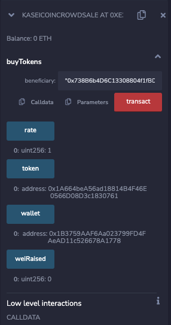

# KaseiCoin Crowdsale 

Smart Contract On Locla Ethereum Blockchain that deploys crowsdale contract to purchase KaseiCoin 'KAI' or KasieCoin Tokens. 

In this assigment we will be using blockchain decknology to define a new Crypto Currency to colonize Mars . 

Kasai Coin will be a fungable token that is ERC-20 compliant. The crowsale contract will allow people to are moving to mars exchange Ether to KaseiCoin. 

# Evaluations 

## Creating a ERC-20 Compliant Token 

### Import the following contracts from the OpenZeppelin library and create a Contructor to inherit the imported libraries and Compile the Contract :

* `ERC20`
* `ERC20Detailed`
* `ERC20Mintable`

## Compile Contract and check for Bugs

----------------------

*Note: ERC-20 Detailed was ledt Blank Since mint funciton will be called from deployer*

_______________________________

## Creating the Crowdsale Contract

### Import and inherit the following open Zeppelin Contracts 

* `Crowdsale`
* `MintedCrowdsale`

## Create a contructor to provide patameters for the crowdsale features for fundsasing 

* `rate`
* `wallet`
* `token`

### Compile Contract and check for Bugs

## Creating the Crowdsale Deployer Conntract

### The Deployer contract will be in the same `KaseiCoinCrowdsale.sol` file. 

* Add a varables to store address's for `KaseiCoin` and `KaseiConCrowdsale`, which thi contract will deploy.
* add following parameters to the constructor : `name`, `symbol` and `wallet`

### Compile Contract and check for Bugs

## Deploy contract to local Block Chain using Remix MetaMask and Ganache

* Test the crowdsale using test accounts: buy new tokens and Check the balance of account

* Review the total supply of minted Token and the amount of wei the crowdsale has raised.

